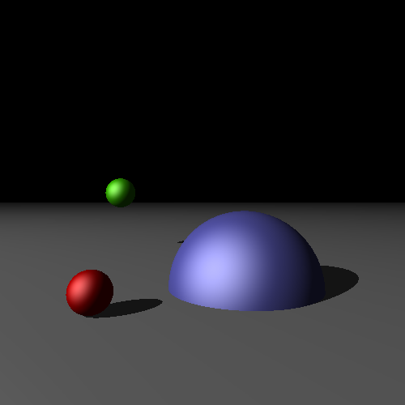

##*Raytracing*

-----
**CMake Build instructions**

-----
  - Out-of-source build :
 ```
git clone git@github.com:Modelisation5ETI/TP6_RayTracing.git && \
mkdir TP6_RayTracing-build && cd TP6_RayTracing-build  && \
cmake ../TP6_RayTracing  && \
make -j
 
 ```
  - QtCreator :
 ```
git clone git@github.com:Modelisation5ETI/TP6_RayTracing.git  && \
mkdir TP6_RayTracing-build && cd TP6_RayTracing-build  && \
qtcreator ../TP6_RayTracing
 
 ```
  *Then configure project using QtCreator API* : 
   - *Set the build directory to TP6_RayTracing-build/*
   - *Run CMake and build project*


-----
**Implementation**

-----

 

 ```
 ./Raytracing
 ```
The current implementation generates images in the build directory. 
TODO:
 -make it real time using GPU
 -Raytrace a mesh
